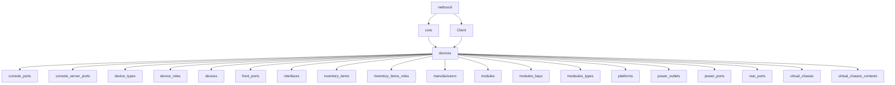

#devices
::: devices

subclasses of devices

```mermaid
graph TD;
    A[netboxcli] --> B[core];
    B --> D;
    A --> C[Client];
    C --> D[devices];
    D --> E[console_ports];
    D --> F[console_server_ports];
    D --> G[device_types];
    D --> H[device_roles];
    D --> I[devices];
    D --> J[front_ports];
    D --> K[interfaces];
    D --> L[inventory_items];
    D --> M[inventory_items_roles];
    D --> N[manufacturers];
    D --> O[modules];
    D --> P[modules_bays];
    D --> Q[modeules_types];
    D --> R[platforms];
    D --> S[power_outlets];
    D --> T[power_ports];
    D --> U[rear_ports];
    D --> V[virtual_chassis];
    D --> W[virtual_chassis_contexts];
```