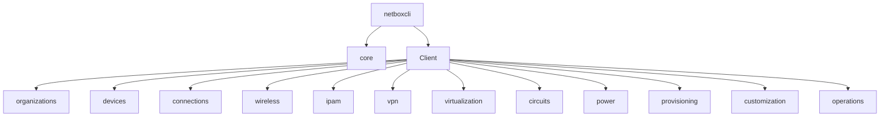

# Getting started

Este guia fornece uma visão geral do Netboxcli e como começar a usá-lo para interagir com o NetBox.


## 📄 Dependências
Lista as dependencias
* requests
* python 3.11 ou superior
* [netbox >=3.7.5](https://github.com/netbox-community/netbox)

## 🔧Instalação

### 📁 Acesso ao projeto

Apresentar formas de baixar seu projeto.

[PiP](https://pypi.org/project/netboxcli/)

[Baixar projeto](https://github.com/Kaioguilherme1/netbox-client/archive/refs/heads/main.zip)
#### Baixar o pacote via terminal.
```
pip install netboxcli
```
## ⚙️ Uso

O NetboxCli é uma ferramenta poderosa para interagir com o NetBox de maneira simples e eficiente. Ele oferece classes consistentes com métodos padronizados para lidar com diversas funcionalidades, incluindo IPAM e Virtualização. Você pode navegar entre as classes da mesma forma que nas abas do NetBox. Aqui estão os passos básicos para começar a usar o NetboxCli:

### Importando o Módulo e Preparando a Conexão

Antes de começar a interagir com o NetBox, você precisa importar o módulo `netboxcli` e criar um objeto NetBox para estabelecer a conexão com o servidor. Substitua `'sua_url_aqui'` pelo endereço IP e porta do seu servidor NetBox e `'seu_token_aqui'` pelo seu token de API.

```python
import netboxcli as nb
import json

def printj(data):
    print(json.dumps(data, indent=4))

# Criar um objeto NetBox
nb_client = nb.Client('sua_url_aqui', 'seu_token_aqui')

```

### Utilizando Classes Finais Padrão

Todas as classes finais no NetboxCli têm os mesmos nomes que as classes do NetBox por padrão. Isso facilita a navegação e a familiarização com a estrutura. Aqui estão alguns exemplos de como você pode usar essas classes e seus métodos padronizados:

### Exemplo de IPAM: Criar um Novo Bloco de Endereços IP

```python
# Exemplo de criação de um novo bloco de endereços IP
ip_block_data = {
    "prefix": "192.168.10.0/24",
    "description": "Bloco de IPs para Servidores",
    "vlan": 100
}

new_ip_block = nb_client.ipam.prefixes.create(ip_block_data)

```

### Exemplo de Virtualização: Obter uma Máquina Virtual por ID

```python
# Exemplo de obtenção de uma máquina virtual por ID
vm_by_id = nb_client.virtualization.virtual_machines.get(id=1)

```

### Exemplo de IPAM: Atualizar um Bloco de Endereços IP

```python
# Exemplo de atualização de um bloco de endereços IP
updated_ip_block_data = {
    "id": 1,
    "description": "Novo Descrição para o Bloco de IPs"
}

updated_ip_block = nb_client.ipam.prefixes.update(updated_ip_block_data)

```

### Exemplo de Virtualização: Excluir uma Máquina Virtual

```python
# Exemplo de exclusão de uma máquina virtual pelo ID
deleted_vm_id = nb_client.virtualization.virtual_machines.delete(id=1)

```