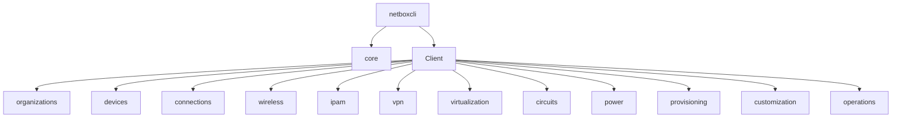

# Getting started

This is a guide to help you get started with the project.

```mermaid
graph TD;
    A[netboxcli] --> B[core];
    A --> C[Client];
    C --> D[organizations];
    C --> E[devices];
    C --> F[connections];
    C --> G[wireless];
    C --> H[ipam];
    C --> I[vpn];
    C --> J[virtualization];
    C --> K[circuits];
    C --> L[power];
    C --> M[provisioning];
    C --> N[customization];
    C --> O[operations];
```