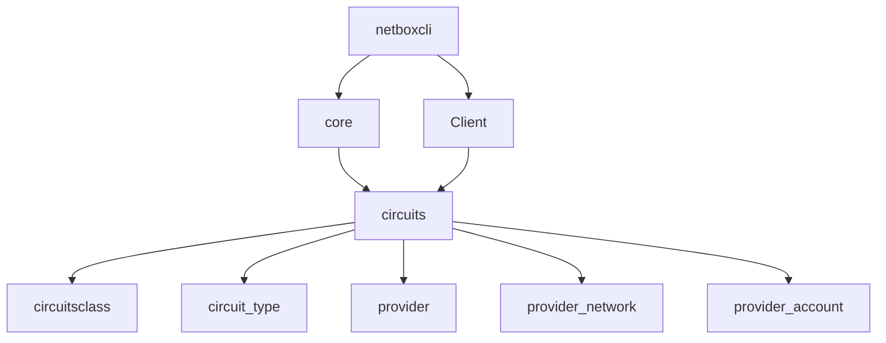

#circuits
::: circuits

## SubClass

subclasses of circuits

```mermaid
graph TD;
    A[netboxcli] --> B[core];
    B --> D;
    A --> C[Client];
    C --> D[circuits];
    D --> E[circuitsclass];
    D --> F[circuit_type];
    D --> G[provider];
    D --> H[provider_network];
    D --> I[provider_account];
```