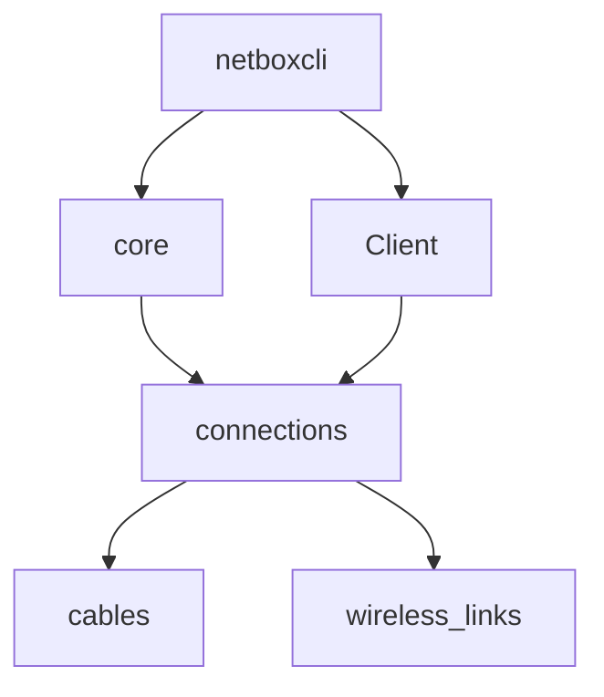

#connections
::: connections

subclasses of connections

```mermaid
graph TD;
    A[netboxcli] --> B[core];
    B --> D;
    A --> C[Client];
    C --> D[connections];
    D --> E[cables];
    D --> F[wireless_links];
```