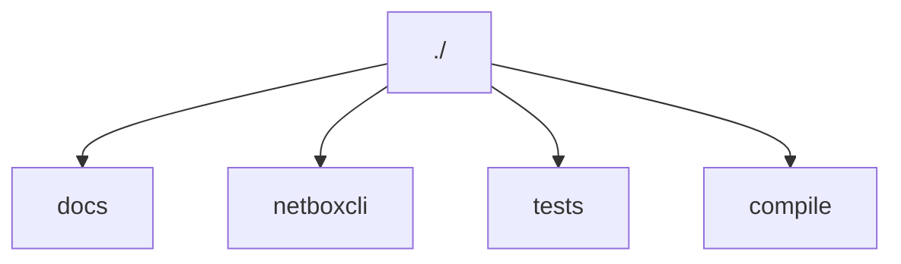
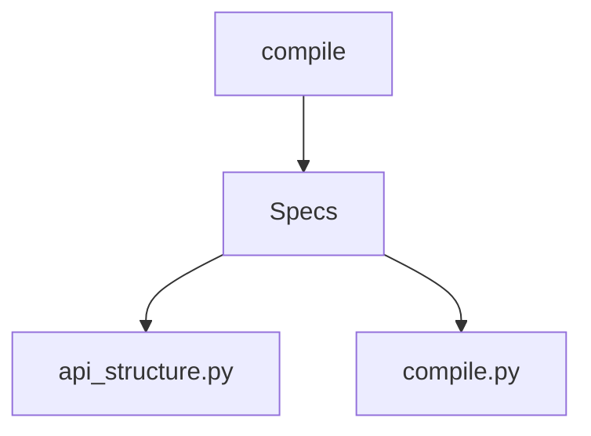

# Contribua

Este projeto é um software livre e de código aberto, o que significa que você pode contribuir com o desenvolvimento do projeto de várias maneiras,
como reportando bugs, sugerindo melhorias, enviando correções de código ou adicionando novos recursos.

## :material-tools: Ferramentas 

Este projeto foi desenvolvido com as seguintes ferramentas:

 * [poetry](https://python-poetry.org/) para gerenciamento de dependências
 * [taskpy](https://github.com/taskipy/taskipy) para automação de tarefas
 * [mkdocs](https://www.mkdocs.org/) para documentação
 * [mkdocs-material](https://squidfunk.github.io/mkdocs-material/) para tema de documentação
 * [pytest](https://docs.pytest.org/en/6.2.x/) para testes unitários
 * [black](https://black.readthedocs.io/en/stable/) para formatação de código
 * [commitizen](https://commitizen-tools.github.io/commitizen/) para padronização de mensagens de commit


## :fontawesome-solid-user-gear: Como contribuir

Primeiramente, obrigado por considerar contribuir com o projeto! Sua ajuda é muito bem-vinda.

Para contribuir com o projeto, siga as etapas abaixo:

1. clone o repositório para sua máquina local:


```bash
git clone https://github.com/Kaioguilherme1/netbox-client.git
```

2. Instale as dependências do projeto:

primeiramente, instale o pipx para instalar o poetry docemtação [aqui](https://pypa.github.io/pipx/)

Agora, instale o poetry, que é o gerenciador de dependências do projeto:

```bash
pipx install poetry
```

agora dentro da pasta do projeto, instale as dependências do projeto:

```bash
poetry install
```

pronto, agora você tem todas as dependências do projeto instaladas.


## Estrutura de pastas

O projeto é organizado da seguinte forma:



onde cada pasta tem a seguinte função:

- `docs`: contém a documentação do projeto, escrita em Markdown.
- `netboxcli`: contém o código-fonte do projeto, incluindo classes, métodos e funções.
- `tests`: contém os testes unitários do projeto, escritos em Python.
- `compile`: contém scripts de automação e criação de padronização e documentação do pacote.

### :simple-googledocs: docs

A documentação do projeto é escrita em Markdown e está localizada na pasta docs. 
Para contribuir com a documentação, você pode editar os arquivos Markdown diretamente ou criar novos arquivos conforme necessário, 
seguindo a estrutura de pastas, subpastas e arquivos existentes. Cada arquivo Markdown deve estar organizado com um título e uma descrição do conteúdo, tornando-o uma página da documentação.

### :material-chevron-left-box-outline: netboxcli

A estrutura do projeto é organizada em classes e métodos,
cada um com uma função específica para interagir com o NetBox e realizar operações comuns.
pode-se ver a estrutura do projeto [aqui](client/index.md), sendo que as ultimas subclasses são criadas a partir de scripts de automação,
localizados na pasta compile.

### :material-test-tube-empty: tests

Os testes unitários do projeto são escritos em Python e estão localizados na pasta tests, contendo um teste de uso aplicado 
a um netbox remoto.

### :simple-compilerexplorer: compile

Os scripts de automação e criação de padronização e documentação do pacote estão localizados na pasta compile, onde
temos a seguinte estrutura:


onde cada script tem a seguinte função:

- `Specs`: pasta que contém as configurações padronizadas de cada sub classe configurando o nome dos arquivos, classes e quais metodos estaram disponiveis para cada classe.
- `api_structure.py`: define as configurações padroeizadas de cada sub classe onde são especificadas as funções e métodos de forma padronizada para todos.
- `compile.py`: script de automação que cria as sub classes a partir das configurações padronizadas.

!!! warning "Aviso"
    Cuidado ao editar as especificações de cada subclasse, pois isto pode gerar inconsistencias nos imports e nos metodos de cada classe.

!!! info "Dica"
    Para contribuir com o projeto, você pode criar novas sub classes a partir de scripts de automação, localizados na pasta compile, seguindo as especificações padronizadas de cada subclasse.

## Mão no código
 
Agora que você já tem o projeto instalado e entendeu como ele funciona, você pode começar a contribuir com o código,
a seguir algumas dicas para contribuir com o projeto assim como ultilizar as ferramentas de automação e padronização do projeto.

!!! info "Dica"
    antes de começar a editar o código, é importante entrar no ambiente virtual do poetry, para isso, execute o seguinte comando:
    
    ```bash
    poetry shell
    ```

### :material-tools: Ferramentas

o projeto conta com algumas ferramentas de automação e padronização, como o `taskpy` e o `black`, que são usadas para automatizar tarefas e padronizar o código, respectivamente.

#### :material-code-tags-check: Padronização de código

o projeto foi padronizado com o `black`, que é uma ferramenta de formatação de código, para padronizar o código, execute o seguinte comando:

```bash
task lint-fix
```

E a Formatação da documentação interna da lib e feita no padrao docstring da google, seguindo este padrão:

```py
def create(self, data) -> dict:
    """
    Descrição
    
    Args:
        data (list or dict): Argumentos
        
    Examples:
        Exemplo de uso
    
    Returns:
        data:  Retorno
    """
    return data
```

para saber mais sobre o padrão de docstring da google, acesse a [documentação](https://google.github.io/styleguide/pyguide.html#s3.8.1-comments-in-doc-strings)

#### Compilação de Classes :material-code-tags-check:

O projeto possui um script de automação que gera as subclasses com base nas configurações padronizadas. Para criar as subclasses, execute o seguinte comando:

Acesse a pasta `compile` e execute o comando abaixo para compilar as classes:

```bash
python3 compile.py code
```

Para atualizar a documentação detalhada do código na documentação, utilize o seguinte comando:

```bash
python3 compile.py docs
```

Para editar as configurações de cada subclasse, acesse a pasta `Specs` e edite o arquivo correspondente a subclasse que deseja alterar.
sendo organizado em arquivos json, onde cada arquivo e uma classe e cada chave e uma subclasse, onde contem as configurações de cada subclasse, assim como quais metodos padrões estarão disponiveis para cada subclasse.
observe no exemplo a seguir a estrutura de um arquivo de configuração:

```json
    "Class_name": "devices",
    "sub_classes": [
        {
        "name": "devices",
        "class": "DevicesClass",
        "docs": "Responsable for managing devices items",
        "methods": [
            "GET",
            "POST",
            "PUT",
            "DELETE"
        ]
        },
        {
        "name": "modules",
        "class": "Modules",
        "docs": "Responsable for managing modules items",
        "methods": [
            "GET",
            "POST",
            "PUT",
            "DELETE"
        ]
    },
```
neste exemplo, temos a classe `devices` que contem duas sub classes, `devices` e `modules`, onde cada uma tem seus metodos padronizados, e suas documentações.
com base nesta entrada o script de automação ira criar as sub classes `DevicesClass` e `Modules` com os metodos padronizados e suas documentações.
sendo estas classes e seus metodos definidos no arquivo `api_structure.py`. como podemos ver um exemplo a seguir de como esta estruturado o arquivo `api_structure.py`:


```py title="api_structure.py"
class_header = '''
class {class_name}:
    """
    {docstring}

    Args:
        core (obj): Core object for create, retrieve, update, and delete actions.

    """
    def __init__(self, core):
        self._core = core
'''

metods = {
    'POST': '''
    def create(self, data) -> dict:
        """
        Create a new resource in {subclass} using the provided data.
        
        Args:
            data (list or dict): Data it can be a dictionary or a list of dictionaries containing the information to create the resource.
            
        Examples:
            Create a new client:
            >>> from netboxcli import Client
            >>> nb = Client('http://localhost:8000', 'token')
            
            Create a new resource:
            >>> data = {{'name': 'resource_name'}}
            >>> result = nb.{class_main}.{subclass}.create(data)
        
        Returns:
            dict: {{'status': 200, 'data': {{'result': {subclass}]}}}}
        """
        return self._core.create(data)
    '''
}
```

assim podemos ver que o arquivo `api_structure.py` contem as configurações padronizadas de cada subclasse, onde são especificadas as funções e métodos de forma padronizada para todos, porém
isto so se aplica as sub classes que estão configuradas no arquivo `Specs`, logo se você deseja adicionar uma nova subclasse, você deve adicionar a configuração no arquivo `Specs` e adicionar a classe e seus metodos no arquivo `api_structure.py`.

#### :material-code-tags-check: Testes

atualmente o projeto conta com dois teste unitários, um teste de uso aplicado a um netbox remoto e um teste de padronização de código,
para executar os testes, execute o seguinte comando:

teste de uso padrão:

```bash
task test
```

este teste irá executar o cada metodo de cada subclasse, e verificar se o retorno é o esperado, antes disso ele ira verificar o codigo esta padronizado.
caso não esteja você pode executar o seguinte comando para padronizar o código:

para corrigir o código de forma automática, execute o seguinte comando:
```bash
task lint-fix
```

ou para verificar se o código está padronizado, execute o seguinte comando:

```bash
task lint
```

Para executar o teste de uso aplicado a um netbox remoto, você deve configurar as variáveis de client dentro do arquivo `tests/test.py` e executar o seguinte comando:

```bash
task test_get
```

!!! info "Informação"
    Este codigo testa tanto a conexão com o netbox quanto tests de erros no lado do servidor, logo ele pode dar o estatus de `passed` mesmo que o netbox esteja fora do ar, então lembre-se de verificar os logs gerados pelo teste.

#### :material-code-tags-check: Documentação

A documentação do projeto é escrita em Markdown e está localizada na pasta docs, seguindo a estrutura de pastas, subpastas e arquivos existentes.
onde toda a padronização e a recomendada pelo [mkdocs](https://www.mkdocs.org/) e [mkdocs-material](https://squidfunk.github.io/mkdocs-material/), logo para visualizar a documentação localmente, execute o seguinte comando:

```bash
task docs
```

!!! info "Dica"
    Para contribuir com a documentação, você pode editar os arquivos Markdown diretamente ou criar novos arquivos conforme necessário, seguindo a estrutura de pastas, subpastas e arquivos existentes.

!!! info "Dica"
    Você pode ultilizar qualquer feature disponivel no mkdocs de personalizações, para saber mais acesse a documentação abaixo:

links uteis:

- [mkdocs-meterial](https://squidfunk.github.io/mkdocs-material/reference/admonitions/)
- [icons](https://squidfunk.github.io/mkdocs-material/reference/icons-emojis/#search)
- [mermaid](https://mermaid-js.github.io/mermaid/#/flowchart)

#### Commits :material-code-tags-check:

O projeto utiliza o `commitizen` para padronizar as mensagens de commit. Para criar um commit, execute o seguinte comando:

!!! info "Dica"
    Antes de executar o comando de commit, adicione os arquivos que deseja commitar e verifique se o código está padronizado e se os testes passaram.

```bash
task commit
```

Agora é só preencher as informações solicitadas e o commit será feito de forma padronizada. Após o commit, você pode fazer o push para o repositório remoto.

## Não achei o que preciso aqui

Caso não tenha encontrado o que precisa, você pode abrir uma [issue no projeto](https://github.com/Kaioguilherme1/netbox-client/issues) relatando o que não consegue fazer ou o que precisa ser melhor documentado

## Melhoria contínua

Esse documento pode ser melhorado por qualquer pessoa que tenha interesse em melhora-lo. Então, sinta-se a vontade para fornecer mais dicas as pessoas que desejam contribuir também :heart:


